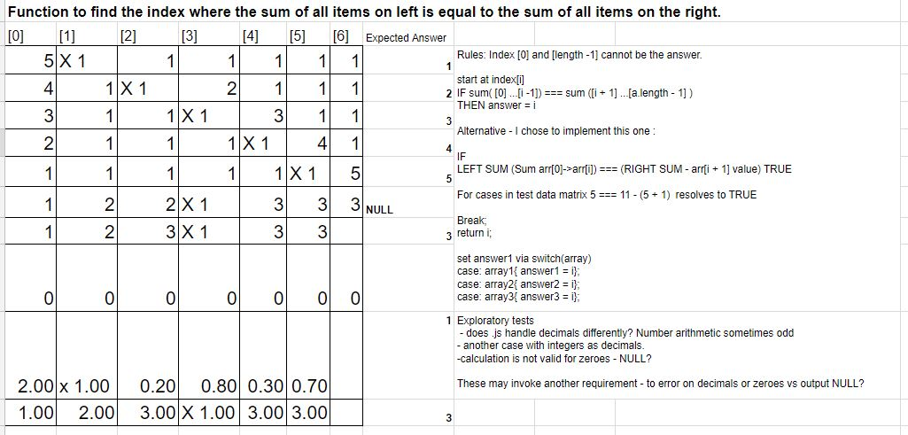

## Approach to test definition
  - E2E workflow - to scrape data into array, calculate answer via a function and submit answers into a grid.
  - Tests in scope:
      - Function to find the index where the sum of all items on left is equal to the sum of all items on the right.
      - Logic and test case definition below

      Logic and Test Cases:
      

      - Framework drives workflow from scraping data to clicking the Submit answers button to verify function tested above.

  - Tests out of scope:
      - Appearance and accessibility of UI under test.
      - Submit answer checking logic.

## Choice of test runner

The task prescribes that selenium-webdriver be used. As this is a react-app I chose to use Jest test-runner.
I also installed jest-environment-webdriver as a bridge, pulling selenium commands into Jest.
Jest ships with jsdom which simulates a DOM environment as if you were in the browser.  I used npm where possible instead of yarn, in order to access modules helpful to Jest. Thus there are yarn.lock and package.json.lock, which is not recommended. However this has not impacted localtest running.  

## Dependencies updates
I had incompatibility issues with existing app Yarn install
See https://github.com/facebook/create-react-app/issues/4367
  - Node v9.11.2
  - upath 1.0.5
  - I had an error "Couldn't find preset "stage-1" relative to directory"/Users/DOE/Projects/ECSD/qa-tech-test".
  https://babeljs.io/docs/en/next/babel-preset-env.html was applicable so I chose to update to "react" and "es2015" presets.
    This required updates to babelrc and package.json for jest config, in line with the later versions.
  - chromedriver and geckodriver

## Changes to React app

    - I changed option on elem.scrollIntoView to change behavior:smooth to behavior:instant.
    - I added an id to several elements which made locating them easier.
    - I updated the AnswerTable.jsx line 88 to "challenge 2" as there is a typo  

## Future Improvements for test robustness and better practice

  - Use helpers to pull out common functionality e.g. rendering of challenge page
  - This would facilitate smaller files split by 'describe' groups and functions for separation of concerns. Jest can parallel run these for speed.
  - Given more knowledge of selenium and it's interaction with java script I am sure there are more appropriate functions/ commands.
  - I have not given attention to performance and timings and have seen sporadic unexpected failures which could be investigated. The tests can be
    made more resilient with better use of promises via async/await or by adding 'timeouts' at key points.
  - I would add exceptions to the tests to ensure that a real failure can be distinguished from a timing or environment issue.
